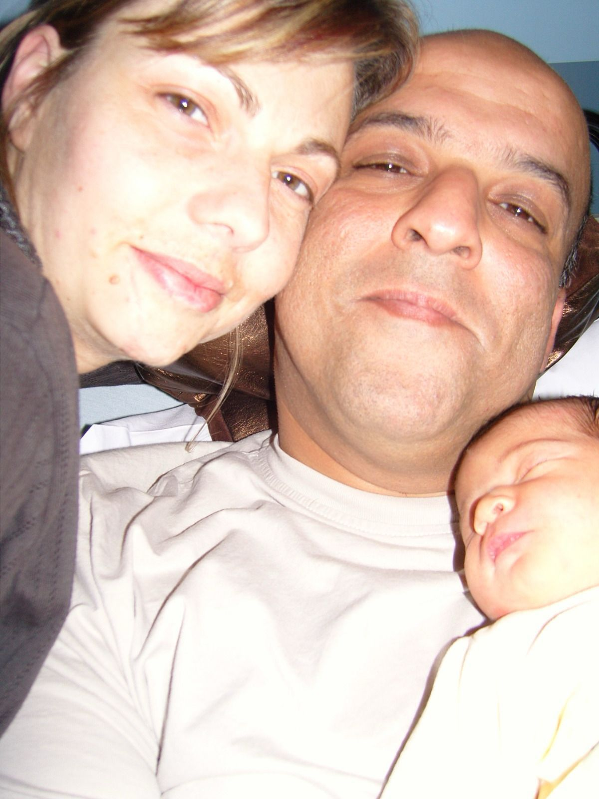

# 🎂 Happy 18th Birthday Maissa — Website

## 📁 Folder Structure

```
18th Birthday/
│
├── index.html              ← Open this file in your browser!
│
├── css/
│   ├── main.css            ← Core styles, layout, colors, typography
│   ├── animations.css      ← All keyframe animations
│   ├── timeline.css        ← Timeline section & photo styles
│   ├── candle.css          ← Cake, flame & blow button styles
│   └── responsive.css      ← Mobile & tablet adjustments
│
├── js/
│   ├── music.js            ← Birthday melody (Web Audio API)
│   ├── particles.js        ← Floating gold particles background
│   ├── candle.js           ← Microphone blow detection + fallback
│   ├── fireworks.js        ← Fireworks & confetti effects
│   └── main.js             ← Site entry, scroll reveal, sparkles
│
├── images/                 ← PUT YOUR PHOTOS HERE
│   ├── baby.jpg            ← Baby photo of Maissa
│   ├── childhood.jpg       ← Childhood photo
│   ├── now.jpg             ← Recent / current photo
│   └── old-maissa.jpg      ← Funny old-age FaceApp edit 😂
│
└── README.md               ← This file
```

## 🚀 How to Run

1. Put all the files in the folder on your desktop:
   `C:\Users\Ahamed Muhanna\Desktop\caca\18th Birthday\`

2. Double-click `index.html` — it opens in your default browser

3. That's it! No server, no install, nothing else needed.

## 📸 How to Add Photos

1. Save your photos in the `images/` folder with these names:
   - `baby.jpg` — baby photo
   - `childhood.jpg` — childhood photo
   - `now.jpg` — recent photo
   - `old-maissa.jpg` — funny old edit

2. Open `index.html` in a text editor (right-click → Open with → Notepad)

3. Find each photo placeholder (search for "📸") and replace:

   **BEFORE:**
   ```html
   <div class="timeline-photo-placeholder">
     <span class="photo-icon">👶</span>
     <span class="photo-label">Baby Photo</span>
   </div>
   ```

   **AFTER:**
   ```html
   
   ```

4. Do the same for childhood.jpg, now.jpg, and old-maissa.jpg

5. Save the file and refresh your browser!

> **Tip:** Photos can be .jpg, .png, or .webp — just match the filename
> in the `src="images/..."` part.

## 🎤 How the Candle Works

- Scroll to the "Blow Out Your Candle" section
- Click the "Tap & Blow" button
- Allow microphone access when your browser asks
- Blow into your mic! The flame reacts in real-time
- Blow hard enough and it goes out → fireworks + confetti! 🎆
- If mic doesn't work, you can tap the flame instead

## ✏️ Customizing the Messages

Open `index.html` in Notepad and edit the text between the HTML tags.
Everything is clearly labeled with comments so you can find each section.

## 💡 Browser Tips

- Works best in Chrome, Edge, or Firefox
- For music to auto-play, the browser needs a user click first
  (that's what the "Enter the Celebration" button handles)
- Mic access needs HTTPS in some browsers, but works fine
  when opening a local file (file://)

---

Made with ❤️ for Maissa's 18th birthday
